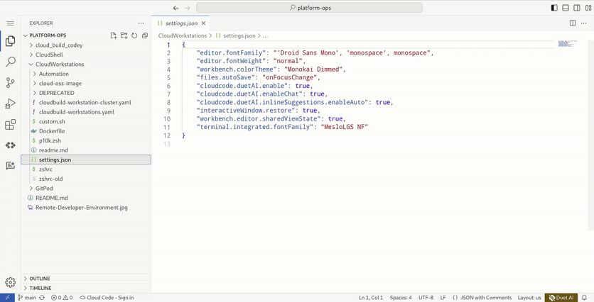
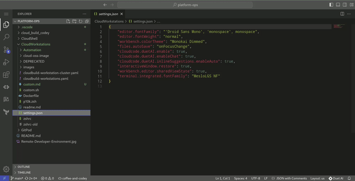

# Unleash Your Coding Superpowers: The Epic Tale of Customising My Cloud Development Environment with a Side of Java (Coffee, That Is!)


Hey there, fellow code warriors! We all know the thrill of customising our [working | coding] environments, right? It's like trying to find that perfect coffee grind for your latest beans to get an epic morning v60 brewed. I used to lose myself for hours, fine-tuning my terminal colours, crafting the most epic prompts, and basically making my computer look as cool as the latte art by a winning barista at the [world latte art championship](https://www.youtube.com/watch?v=XGSL0vqm2e4). I even went as far as creating a labyrinthine [collection of dotfiles](https://github.com/sapientcoffee/dotfiles) and a convoluted bootstrap process (don't judge, we've all been there)! While it was meant to be reusable then ended up being single use and long lived with the life of a machine (multiple years back then).

These days, my laptop/desktop often serve as little more than high-priced web browsers and I regularly alternate or change devices. Ultimately I live in Chrome, surrounded by a thousand tabs, and that's where 90% of my coding magic also happens. That's why I've embraced Cloud Development Environments (CDE), a game-changer that I've been rocking for a while now. Even though my CDE is often as fleeting as a shooting star, I still want it to be familiar, efficient, and maybe even sprinkle a little street cred into my coding sessions. I still remember the first time I picked up an iPad pro (with a keyboard) to do some work in my favourite coffee shop and seamlessly update some code to transition back to my laptop when I returned home like it was the same device, just with an upgraded keyboard and monitor 😁.

Lately, I've been diving deep into [Google Cloud Workstations](https://cloud.google.com/workstations) for my CDE needs. It offers Google-maintained base images, preconfigured with awesome IDEs like Code OSS, IntelliJ, PyCharm, and more. So, I thought, why not share my journey of tweaking these base images with customised themes, plugins, CLI tools, and terminal wizardry? Buckle up, because I'm about to take you on a thrilling ride through the world of custom cloud development environments. Hold onto your code and don't spill that coffee while I take you from;



to =>



## 🚀 Step 1: Base Image Configuration 🚀
First things first, let's talk base images. Customising them is a [breeze](https://cloud.google.com/workstations/docs/customize-container-images), thanks to the fact that each workstation image is container-based. To get started, I grabbed the latest and greatest Code OSS image maintained by Google Cloud and added it to my Dockerfile, just like choosing your favourite single origin coffee beans:

```
FROM us-central1-docker.pkg.dev/cloud-workstations-images/predefined/code-oss:latest
``````

Then, I threw in some additional CLI tools that didn't come with the base image but are absolute must-haves for me, like [Terraform](https://developer.hashicorp.com/terraform/cli/commands), [Firebase](https://firebaseopensource.com/projects/firebase/firebase-tools/), and [Kustomize](https://kubectl.docs.kubernetes.io/installation/kustomize/). Here's a peek at how I did it using pretty standard Dockerfile methods:

```
ARG TERRAFORM_VERSION=1.6.3

# Install tooling
## terraform
RUN wget --progress=dot:mega https://releases.hashicorp.com/terraform/${TERRAFORM_VERSION}/terraform_${TERRAFORM_VERSION}_linux_amd64.zip

RUN \
   # Unzip
   unzip terraform_${TERRAFORM_VERSION}_linux_amd64.zip && \
   # Move to local bin
   mv terraform /usr/local/bin/ && \
   # Make it executable
   chmod +x /usr/local/bin/terraform && \
   # Check that it's installed
   terraform --version && \
   echo "installed terraform"

## Kustomize
RUN curl -s "https://raw.githubusercontent.com/kubernetes-sigs/kustomize/master/hack/install_kustomize.sh"  | bash && echo "installed kustomize"

## Firebase CLI
RUN curl -sL https://firebase.tools | bash && echo "installed firebase CLI"
```

With the binaries in place, it was time to sprinkle some plugin magic into my IDE. I simply downloaded these plugins and placed then in the relevant directory via my Dockerfile, grabbing them from [open-vsx](https://open-vsx.org) (more examples exist in the [documentation](https://cloud.google.com/workstations/docs/extensions-marketplace)):
```
# Install Code OSS Plugins (from open-vsx.org)
RUN wget https://open-vsx.org/api/hashicorp/terraform/linux-x64/2.28.2/file/hashicorp.terraform-2.28.2@linux-x64.vsix  && \
unzip hashicorp.terraform-2.28.2@linux-x64.vsix "extension/*" &&\
mv extension /opt/code-oss/extensions/terraform
```

Once my custom image was all set, I created it and pushed it to Artifact Registry using `gcloud builds submit`. I even set up a Cloud Build [workflow](https://cloud.google.com/workstations/docs/extensions-marketplace) to keep my image versioned and patched, ensuring my workstation is always up to date without interrupting my workflow. How cool is that?

## 💥 Step 2: Machine/User Settings (Sipping Coffee & Tweaking Settings) 💥

Now that we have a rock-solid base image, it's time to dive into personalisation. As a long-time fan of zsh (just check out my dotfiles repo from the good ol' days), I knew it was the way to go. I made sure to install zsh in my Dockerfile:

```
## zsh
RUN apt install -y zsh && echo "installed zsh"
```

But wait, there's more! Cloud Workstations offer machine, user, and workspace settings. 
🌟 Machine Settings: These apply globally when you connect to your Cloud Workstations virtual instance and are stored in your `$HOME/.codeoss-cloudworkstations/settings.json` file.
🌟 User Settings: These also apply globally and persist in browser storage for each workstation instance.
🌟 Workspace Settings: Stored within a workspace, these settings only apply when you're working in that specific workspace and appear alongside your workspace files in the `$WORKSPACE_ROOT/.vscode/settings.json` file.

Now, let's sprinkle some themes, terminal plugins, and customizations into the mix. I crafted a script that runs during creation, customising the configuration and adding it to the default Cloud Workstations bootstrapping directory (`/etc/workstation-startup.d/`). Following the [documentation's](https://cloud.google.com/workstations/docs/customize-container-images#cloud-workstations-base-image-structure) sage advice, I named it `200_custom.sh`. Because scripts in this directory run as root by default, I used the `runuser` command to run it as a different user (i.e. the workstation user). Here's a taste of the magic:

```
#!/usr/bin/env bash

set -e # bail out early if any command fails
set -u # fail if we hit unset variables
set -o pipefail # fail if any component of any pipe fails

runuser user -c 'touch ~/.rob'
runuser user -c 'mkdir /home/user/workspace'

echo 'cleaning up previous installs'
runuser user -c 'rm -rf /home/user/.oh-my-zsh/'

echo 'install oh-my-zsh'
runuser user -c 'sh -c "$(curl -fsSL https://raw.githubusercontent.com/ohmyzsh/ohmyzsh/master/tools/install.sh)" "" --unattended'
echo 'install powerlevel10 theme'
runuser user -c 'git clone https://github.com/romkatv/powerlevel10k.git /home/user/.oh-my-zsh/custom/themes/powerlevel10k'

echo 'Copy IDE settings and terminal settings'
runuser user -c 'cp /sapientcoffee/settings/settings.json /home/user/.codeoss-cloudworkstations/data/Machine/'
runuser user -c 'cp /sapientcoffee/settings/p10k.zsh /home/user/.p10k.zsh'
runuser user -c 'cp /sapientcoffee/settings/zshrc /home/user/.zshrc'

echo 'set zsh as default'
runuser user -c 'echo "exec zsh" >> /home/user/.bashrc'
```

To make these files available, I added them to the container image in a special directory I reserved for all my customizations and scripts (`/sapientcoffee`). Here's how I did it:

```
# Customisation of terminal (zsh, themes and layout)
RUN mkdir -p /sapientcoffee/settings /sapientcoffee/scripts
COPY CloudWorkstations/settings.json CloudWorkstations/p10k.zsh CloudWorkstations/zshrc /sapientcoffee/settings/
COPY CloudWorkstations/custom.sh /etc/workstation-startup.d/200_custom.sh
COPY CloudWorkstations/custom.sh /sapientcoffee/scripts/custom.sh
RUN chmod +x /etc/workstation-startup.d/200_custom.sh /sapientcoffee/scripts/custom.sh
```

What is the purpose of each file?
[`.p10k.zsh`] Terminal prompt configuration that is imported into the container image and transferred to the home directory via custom.sh to customise zsh with the [Powerlevel](https://github.com/romkatv/powerlevel10k) framework.
[`settings.json`] The Code OSS settings to customise the look and feel of the IDE interface (e.g. dark theme, enable DuetAI etc.). Transferred to the workstation container image and copied to the correct location by custom.sh at deployment time.
[`.zshrc`] Zsh configuration that is transferred to the workstation container image and then copied to the correct location by custom.sh at deployment time.

That's it! I've got a sweet, personalised cloud development environment ready to rock. I'd love to hear about your own customisation adventures. Maybe you can help me level up even further? I'm thinking of adding a script that configures individual user settings with a CLI wizard (think `git config`) upon the first start. You can keep track in my [Github repo](https://github.com/sapientcoffee/platform-ops). Let's keep the coding excitement alive! 🚀💻✨

