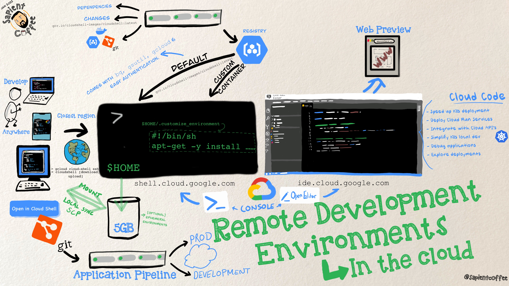

# Platform Operations
Building a collection of examples that platfrom engineering teams could leverage to help with solving user challenges on Google Cloud.

## Cloud Developer Workstations
Cloud Developer Environments (CDE) can be useful tool to help developers get things done, the option on Google Cloud is [Cloud Workstations](https://cloud.google.com/workstations). They can help solve common challenges that sap the time of development teams, things like environment setup (onboarding, cost of hig-end machines, say GPU's), security and exflitration guardrails (contole location of stored source code, securing of workstations) and productivity (accessing resources inside private networks, build times, complex artifacts). 

Two personas that emerge are;
* Admins/platfrom engineers (manage environments and provide access to developers including security polices and secure images)
* Developers (consumer of on-demand, pre-configured environemens that can be access anywhere a browser is available)

Over the years the capabilities and offerings have grown on Google Cloud
* 2016 -> Cloud Shell (Online pre-configured dev environment and terminal with basic code editor)
* 2019 -> [Cloud Code](https://cloud.google.com/code) (Plugins for IntelliJ and VSCode, automation and assistance in the IDE)
* 2020 -> [Cloud Shell Editor](https://cloud.google.com/shell) (Updated IDE with source control, debugger and emulators including enabling quick exploration of cloud services)
* 2023 -> [Cloud Workstations](https://cloud.google.com/workstations)
* 2023 -> [Project IDX](https://developers.google.com/idx) (part of a wider Google experimental new initiative aimed at bringing your entire full-stack, multiplatform app development workflow to the cloud)

So what is the differece between Cloud Shell and Cloud Workstations?
* Cloud Shell (onboarding/learning focused)
  * Pre-configured environment
  * Focus on simple onboarding tasks
  * Integrated with GCP dev tools
  * Accessible from the browser
  * Free, requires no project
  * 5GB of persistent disk
* Cloud Workstations (enterprise grade)
  * Fully customisable environment
  * Full fledged IDE/Dev Environment (choice of IDE)
  * Integrated with GCP dev tools
  * Accessible via browser/SSH/Local IDE
  * Runs on customer owned VMs/Disks
  * Support for VPC and security policies

The following is a high-level overview of remote development in GCP using Cloud Shell and Cloud IDE (need to update for Cloud Workstations);

### Google Cloud Workstaions
Configuration examples and demos are in the [CloudWorkstations](CloudWorkstations/) folder.

### Cloud Shell
Configuration examples and demos are in the [CloudShell](CloudShell/) folder.

