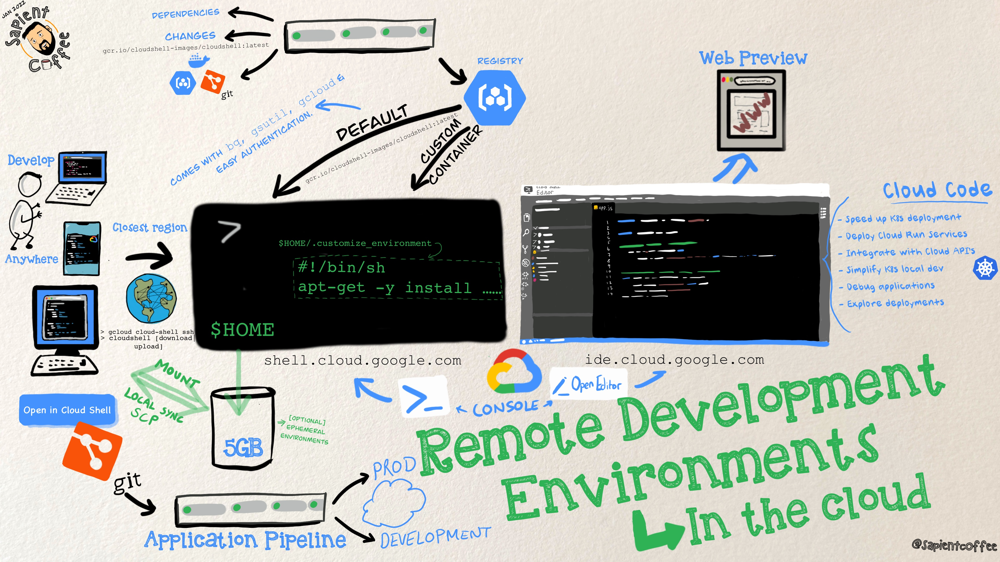

# ☕ Platform Ops: The Perfect Roast for Google Cloud

Welcome to the **Platform Ops** repository! 🌟 This is a curated collection of examples and automation designed to help platform engineering teams serve up the best developer experiences on Google Cloud. Think of this as your secret recipe book for building robust, scalable, and delightful Cloud Developer Environments (CDE).

---

## ☕ The Roasting Machine: Cloud Developer Workstations

Cloud Developer Environments are the "espresso shots" of productivity. They help development teams skip the bitter taste of environment setup and get straight to the "caffeine kick" of coding. On Google Cloud, the premium blend is [Cloud Workstations](https://cloud.google.com/workstations).

### 🌟 Why Cloud Workstations?
*   **Fresh Onboarding**: Get new developers brewing code in minutes, not days.
*   **Security Filter**: Keep source code secure with exfiltration guardrails and private network access.
*   **High-End Grinders**: Need a GPU or 32 vCPUs? Scale your machine to match the task.
*   **Consistent Flavor**: Everyone works on the same secure, pre-configured image.

### 👥 The Personas
*   **The Master Roasters (Admins/Platform Engineers)**: Manage the environments, security policies, and base images.
*   **The Baristas (Developers)**: Consume on-demand, high-performance environments from anywhere with a browser or local IDE.

---

## 📅 Tasting Notes: The Evolution of CDE on GCP

Over the years, the way we brew code on Google Cloud has evolved significantly:

*   **2016** -> **Cloud Shell** 🐚 (The classic instant coffee: pre-configured, free, and accessible).
*   **2019** -> **[Cloud Code](https://cloud.google.com/code)** 🛠️ (The first automation tools for your local IDE).
*   **2020** -> **Cloud Shell Editor** ✍️ (An upgraded IDE experience in the browser).
*   **2023** -> **[Cloud Workstations](https://cloud.google.com/workstations)** 🏗️ (The professional espresso machine: enterprise-grade, customizable, and secure).
*   **2023** -> **[Project IDX](https://developers.google.com/idx)** ✨ (Experimental multiplatform development workflow).
*   **2024** -> **AI Assisted Dev** 🚀 (GenAI integration starts roasting in every workflow).
*   **2025** -> **AI Assisted Dev** 🤖 (The era of AI agents like Jules; **Gemini CLI** becomes the essential tool in the barista's belt).
*   **2026** -> **AI Assisted Dev** ✨ (The "Enterprise" release of Antigravity takes CDEs to a new dimension).

---

## 🖼️ The Brew Process: High-Level Overview

The following diagram illustrates how we transition from legacy setups to modern, powerful Cloud Workstations:

*(Note: Our legacy Cloud Shell and GitPod examples have been moved to the [archive/](./archive/) folder to make room for the new workstation beans!)*

---

## 📂 What's in the Bag?

### 🏗️ [Google Cloud Workstations](./cloudworkstations/base/)
The main course. Dive here for Dockerfiles, startup scripts, and Terraform automation to stand up your own workstation clusters. Now featuring **YADM** for seamless dotfile management!

### 🛰️ [Antigravity GCE Desktop](./gce/antigravity-remote-desktop/)
A high-performance dedicated VM environment for GUI-intensive IDEs like Antigravity, optimized for low-latency access via Chrome Remote Desktop.

### 🧪 [Other Experiments](./cloud_build_codey/)
*   **Cloud Build Codey**: An early experiment in AI-driven builds. Note that this has moved to a more advanced roast over at [GitLab](https://gitlab.com/robedwards/coffee-and-codey.git).

---

Built with ❤️ and a lot of ☕ by the Platform Ops team.
